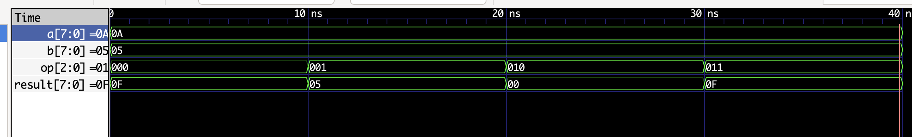

# 8-bit ALU — Verilog HDL

A synthesizable **8-bit Arithmetic Logic Unit** implemented in Verilog, supporting 8 operations via a 3-bit opcode. Verified through simulation with **Icarus Verilog** and **GTKWave**.

---

## Operations

| Opcode | Operation | Expression     | Description         |
|--------|-----------|----------------|---------------------|
| `000`  | ADD       | `a + b`        | Addition            |
| `001`  | SUB       | `a - b`        | Subtraction         |
| `010`  | AND       | `a & b`        | Bitwise AND         |
| `011`  | OR        | `a \| b`       | Bitwise OR          |
| `100`  | XOR       | `a ^ b`        | Bitwise XOR         |
| `101`  | NOT       | `~a`           | Bitwise NOT (a)     |
| `110`  | SHL       | `a << 1`       | Logical shift left  |
| `111`  | SHR       | `a >> 1`       | Logical shift right |

---

## Module Interface

```verilog
module alu (
    input  [7:0] a,       // Operand A
    input  [7:0] b,       // Operand B
    input  [2:0] op,      // Operation select
    output reg [7:0] result
);
```

---

## Project Structure

```
verilog-8bit-alu/
├── src/
│   └── alu.v             # ALU design (combinational)
├── tb/
│   └── alu_tb.v          # Testbench
├── waveform/
│   └── alu_waveform.png  # GTKWave simulation result
└── README.md
```

---

## Simulation

### Requirements
- [Icarus Verilog](http://iverilog.icarus.com/)
- [GTKWave](http://gtkwave.sourceforge.net/)

### Steps

```bash
# 1. Compile
iverilog -o alu_tb tb/alu_tb.v src/alu.v

# 2. Run simulation
vvp alu_tb

# 3. View waveform
gtkwave alu.vcd
```

---

## Simulation Waveform



---

## Example Test Cases

With `a = 0x0A (10)`, `b = 0x05 (5)`:

| Operation | Result        |
|-----------|---------------|
| ADD       | `0x0F` (15)   |
| SUB       | `0x05` (5)    |
| AND       | `0x00` (0)    |
| OR        | `0x0F` (15)   |
| XOR       | `0x0F` (15)   |
| NOT       | `0xF5` (245)  |
| SHL       | `0x14` (20)   |
| SHR       | `0x05` (5)    |

---

## Tools

| Tool           | Purpose                    |
|----------------|----------------------------|
| Verilog HDL    | Hardware description       |
| Icarus Verilog | Compilation & simulation   |
| GTKWave        | Waveform visualization     |

---

## Author

**Ho Minh Thao** — Electronics & Telecommunications Engineering Student  
Interested in Digital IC Design · VLSI · RTL Design
